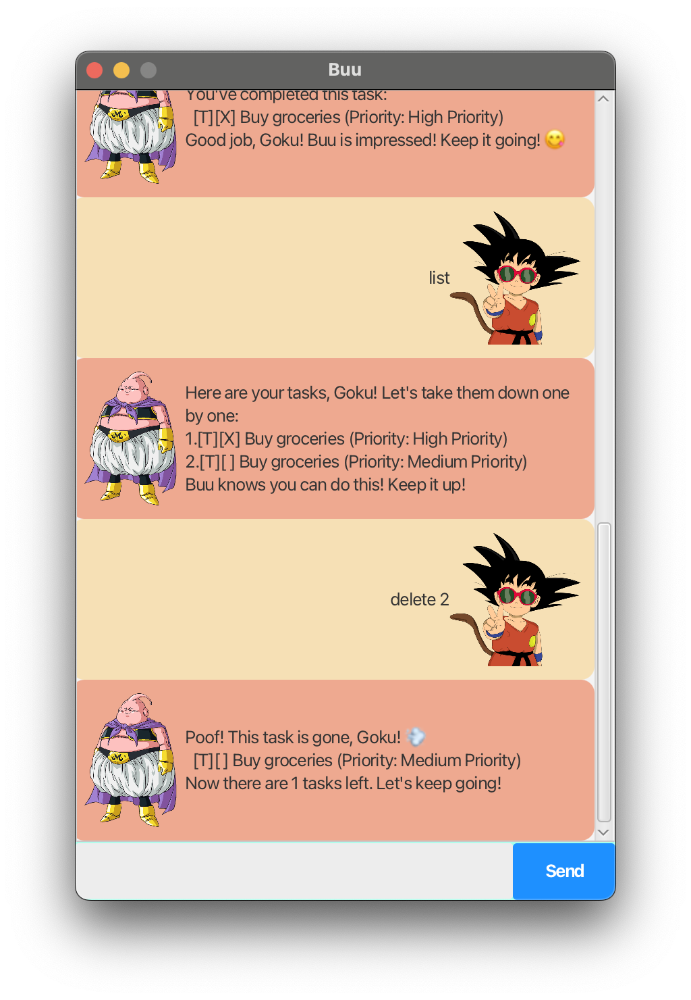

# Buu User Guide
Buu Task Manager is a **command-line application for managing tasks**, inspired by the Dragon Ball character Buu. It offers an interactive and fun way to manage to-do lists, deadlines, events, and priorities while giving playful feedback. If you enjoy the command line and want a lighter approach to task management, Buu Task Manager will help you stay productive.

## Quick start

1. Ensure you have Java `11` or above installed in your Computer.

1. Download the latest `.jar` file from [here](https://github.com/JunLongling/ip/releases).

1. Copy the file to the folder you want to use as the _home folder_ for your Buu Task Manager.

1. Open a command terminal, `cd` into the folder where you put the jar file, and use the `java -jar buu-task-manager.jar` command to run the application. 
   A command-line interface will appear. You can start interacting with Buu and managing your tasks right away.

1. Type the command in the terminal and press Enter to execute it. e.g. typing **`help`** and pressing Enter will show available commands. 
   Some example commands you can try:

   * `list` : Lists all tasks.

   * `todo read book` : Adds a task named `read book` to the task list.

   * `delete 2` : Deletes the 2nd task shown in the current list.

   * `bye` : Exits the app.

1. Refer to the [Features](#features) below for details of each command.

--------------------------------------------------------------------------------------------------------------------

## Features

### Viewing help: `help`

Shows a list of all commands and their descriptions.

Format: `help`

--------------------------------------------------------------------------------------------------------------------

### Adding a To-Do Task: `todo`

Adds a to-do task to your task list.

Format: `todo TASK`

Examples:
* `todo read book`
* `todo finish homework`

--------------------------------------------------------------------------------------------------------------------

### Adding a Deadline: `deadline`

Adds a task with a specific deadline.

Format: `deadline TASK /by YYYY-MM-DD HH:MM`

Examples:
* `deadline submit assignment /by 2024-09-30 23:59`
* `deadline finish project /by 2024-10-01 18:00`

--------------------------------------------------------------------------------------------------------------------

### Adding an Event: `event`

Adds an event task with a start and end time.

Format: `event TASK /from YYYY-MM-DD HH:MM /to YYYY-MM-DD HH:MM`

Examples:
* `event project meeting /from 2024-09-25 10:00 /to 2024-09-25 12:00`
* `event workshop /from 2024-10-05 09:00 /to 2024-10-05 16:00`

--------------------------------------------------------------------------------------------------------------------

### Listing all tasks: `list`

Lists all tasks in your task list.

Format: `list`

--------------------------------------------------------------------------------------------------------------------

### Marking a task as done: `mark`

Marks a task as completed.

Format: `mark INDEX`

Examples:
* `mark 1` marks the first task as done.
* `mark 3` marks the third task as done.

--------------------------------------------------------------------------------------------------------------------

### Unmarking a task: `unmark`

Marks a task as not completed.

Format: `unmark INDEX`

Examples:
* `unmark 2` marks the second task as not done.
* `unmark 1` marks the first task as not done.

--------------------------------------------------------------------------------------------------------------------

### Deleting a task: `delete`

Deletes a task from the task list.

Format: `delete INDEX`

Examples:
* `delete 1` deletes the first task.
* `delete 3` deletes the third task.

--------------------------------------------------------------------------------------------------------------------

### Finding tasks by keyword: `find`

Finds tasks that contain the given keyword.

Format: `find KEYWORD`

Examples:
* `find book` returns tasks with `book` in their descriptions.
--------------------------------------------------------------------------------------------------------------------

### Setting task priority: `priority`

Sets the priority of a task to Low, Medium, or High.

Format: `priority INDEX PRIORITY_LEVEL`

* `1`: Low Priority
* `2`: Medium Priority
* `3`: High Priority

Examples:
* `priority 1 3` sets the first task to High priority.
* `priority 2 1` sets the second task to Low priority.

--------------------------------------------------------------------------------------------------------------------

### Exiting the program: `bye`

Exits the task manager.

Format: `bye`

--------------------------------------------------------------------------------------------------------------------

### Saving the data

Task data is saved automatically after every command that modifies the data. There is no need to save manually.

### Editing the data file

Task data is saved as a text file `[JAR file location]/data/tasks.txt`. You can edit it manually if you're an advanced user, but make sure to follow the correct format.

**Caution:**
Editing the data file incorrectly may cause the app to malfunction. Make sure to back up your file before editing.

--------------------------------------------------------------------------------------------------------------------

## FAQ

**Q**: How do I transfer my data to another computer? 
**A**: Install the app in the other computer and transfer the `tasks.txt` file to the new installation's `data` folder.

--------------------------------------------------------------------------------------------------------------------

## Command summary

| Action                  | Format, Examples                                               |
|-------------------------|----------------------------------------------------------------|
| **Add To-Do**            | `todo TASK`   e.g., `todo read book`                       |
| **Add Deadline**         | `deadline TASK /by DATE_TIME`   e.g., `deadline submit assignment /by 2024-09-30 23:59` |
| **Add Event**            | `event TASK /from START_TIME /to END_TIME`   e.g., `event project meeting /from 2024-09-25 10:00 /to 2024-09-25 12:00` |
| **List All Tasks**       | `list`                                                        |
| **Mark Task as Done**    | `mark INDEX`   e.g., `mark 1`                              |
| **Unmark Task**          | `unmark INDEX`   e.g., `unmark 2`                          |
| **Delete Task**          | `delete INDEX`   e.g., `delete 3`                          |
| **Find Tasks**           | `find KEYWORD`   e.g., `find book`         |
| **Set Task Priority**    | `priority INDEX PRIORITY_LEVEL`   e.g., `priority 1 3`     |
| **Exit**                 | `bye`                                                         |
| **Help**                 | `help`                                                        |

---
